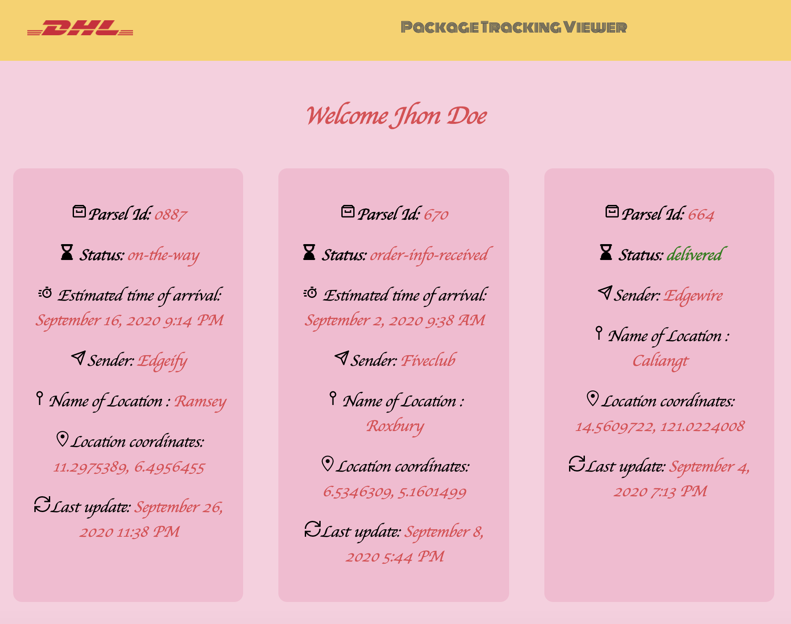
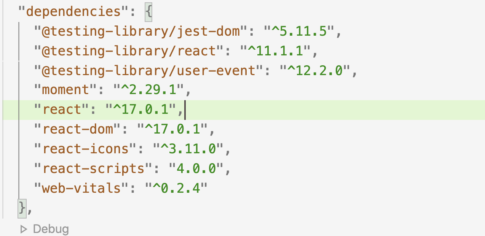
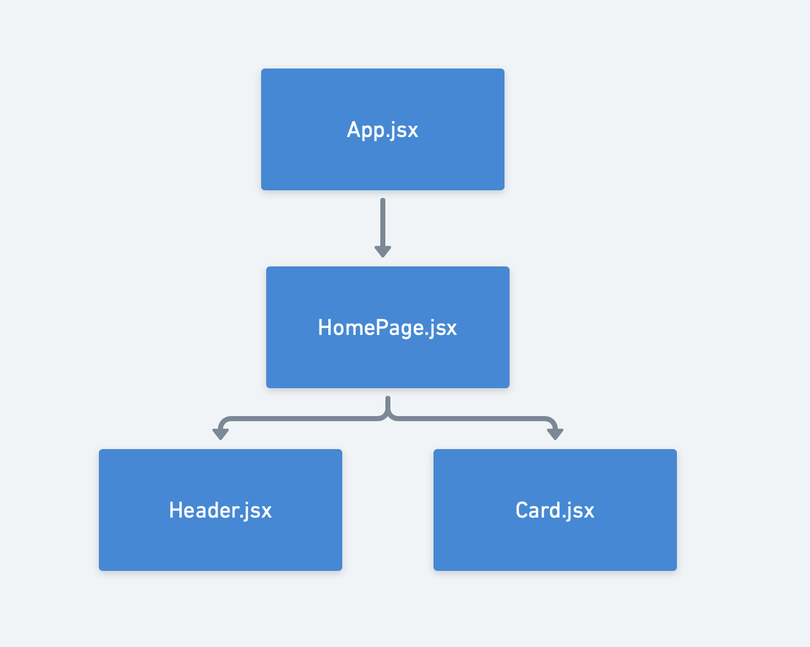

# Getting Started with Package Tracking Viewer

 This single page React-application displays a list of parcels for specific user with some details - order status, estimated time of arrival, pickup locations, sender.

## How to use application 
Download git repository from https://github.com/ray4ik/package_track_viewer

Go to particlar directory via Terminal and clone git repository:
```bash
git clone https://github.com/ray4ik/package_track_viewer
```

Than go to the project folder:
```bash
cd package_track_viewer
``` 

and install:
```bash
npm install
```

To run web application make the next step: 
```bash
npm start
```

You can now view package_track_viewer in the browser.

  Local:             [http://localhost:3000](http://localhost:3000)
  
  On Your Network:    [http://192.168.0.17:3000](http://192.168.0.17:3000)

Note that the development build is not optimized.
To create a production build, use 

```bash
npm run build
```

View of application: 



User can see his or her name and the list of parcel which are belongs to the user. 
This data automatically fetches from [https://my.api.mockaroo.com/orders.json?key=e49e6840](https://my.api.mockaroo.com/orders.json?key=e49e6840)

## Dependencies 
If you open file package.json it will be clear picture what packages are used. 


During development of the current app 2 additional particalar packages were used: 

* ```moment``` - to display the date correctly
* ```react-icons``` which provides a set of icons for the every row in the cards


## Components Diagram and Hierarchy 

The app is the single page React-application which is HomePage.jsx. 
It consists of Header and Card components. 

